<!--HEADER-->

  

<!--SOBRE MIM-->

<h3 align="center">
  <code>// ABOUT ME</code>
</h3>

<h1 align="center">
  Building interfaces, one line of code at a time.
</h1>

  I am a <strong>Web Development student</strong> focused on
  <strong>Front-End Development</strong>.
  I enjoy turning ideas into
  <strong>responsive, accessible, functional, and visually well-structured</strong>
  interfaces while learning, experimenting, and finding new ways to build for the Web.

  I am driven by learning through practice. I enjoy building projects from scratch
  to understand how technologies connect and turn what I study into real interfaces.

  Currently, I am deepening my knowledge of
  <strong>HTML • CSS • JavaScript • React • TypeScript</strong>,
  while gradually expanding my studies into
  <strong>Full Stack Development</strong>.

 

  <code>&gt; learning...</code>
  &nbsp;&nbsp;|&nbsp;&nbsp;
  <code>&gt; building...</code>
  &nbsp;&nbsp;|&nbsp;&nbsp;
  <code>&gt; experimenting...</code>
  &nbsp;&nbsp;|&nbsp;&nbsp;
  <code>&gt; improving...</code>

  <code>STATUS: ONLINE</code>
  &nbsp;&nbsp;•&nbsp;&nbsp;
  <code>FOCUS: FRONT-END DEVELOPMENT</code>

---

<!--INTERESSES-->

<h3 align="center">
  <code>// INTERESTS</code>
</h3>

  I am interested in different aspects of creating for the Web,
  especially how <strong>development, design, accessibility,
  responsiveness, and user experience</strong> can work together
  to create better interfaces.

  
  
  

  
  

---

<!--TECH STACK-->

<h3 align="center">
  <code>// TECH STACK</code>
</h3>

  Technologies and tools that are part of my studies and projects
  as I continue growing in my Web Development journey.

<h4 align="center">Front-End</h4>

  

<h4 align="center">Back-End</h4>

  

<h4 align="center">Tools</h4>

  

---

<!--GITHUB ACTIVITY-->

<h3 align="center">
  <code>// GITHUB ACTIVITY</code>
</h3>

  A record of my progress, the projects I have been building,
  and my learning journey on GitHub.

 

  

 

  
  

---

<!--CONTATO-->

<h3 align="center">
  <code>// CONTACT</code>
</h3>

  Let's connect?

  

  

  

  

---

<!--FOOTER-->

  

